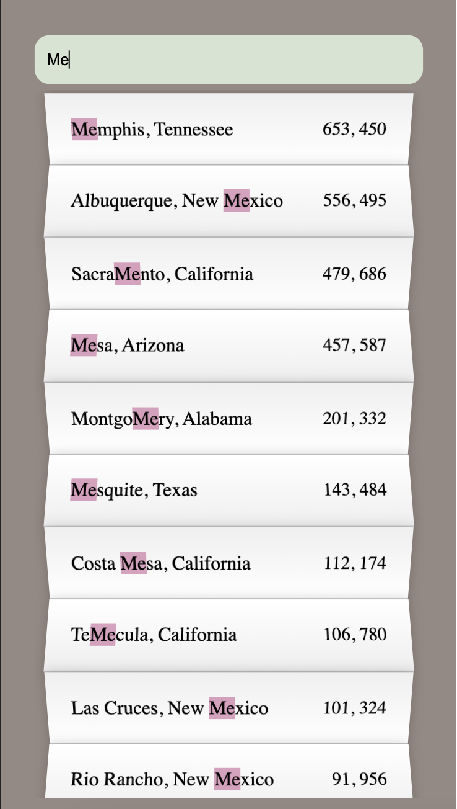
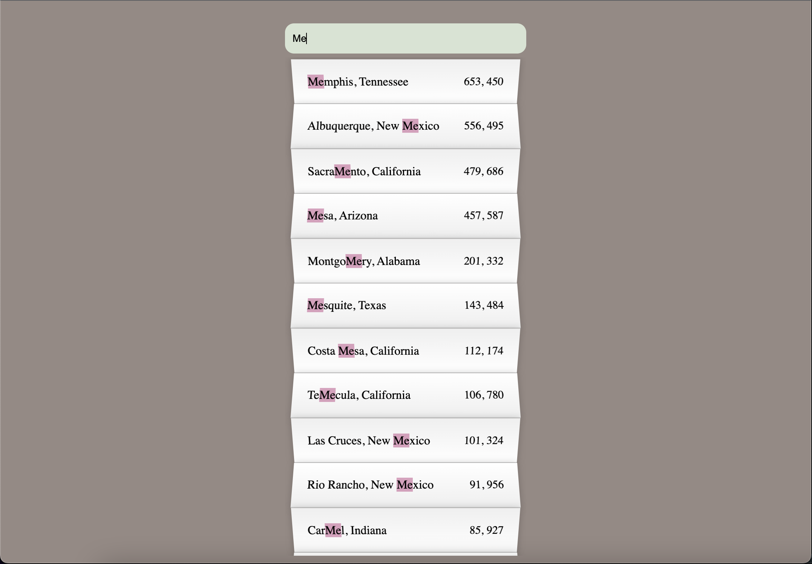

# Search Suggestions

**Pagina que lista 1,000 ciudades de Estados Unidos**

- Contiene una barra de busqueda para filtrar resultados

- Los resultados se muestran en forma de lista debajo de la barra de busqueda

- Se aplican estilos llamativos a los resultados de la busqueda

- Los resultados se actualizan al pulsar una tecla

- Para hacer la busqueda con la palabra completa se presiona enter al final

- Dentro de cada resultado se subraya la o las partes que coincidan con la busqueda

- Se muestra también la población total de cada ciudad

- La lista de resultados es scrolleable

- Pagina adaptable a dispositivos moviles

Puedes ver el resultado [aqui](https://raymundosantorski.github.io/searchSuggestions/).

